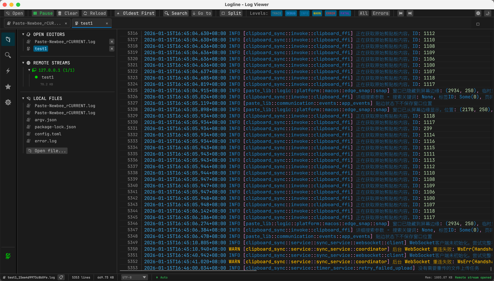
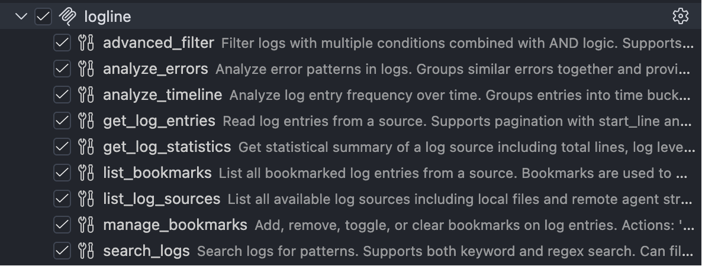

# Logline - High-Performance Real-Time Log Viewer

English | [简体中文](README.md)


Logline is a cross-platform log viewer application built with Rust + egui, focusing on providing high-performance real-time log monitoring and analysis capabilities. It supports MCP (Model Context Protocol) for intelligent log analysis integration with AI assistants.

## 📸 Screenshots

<div align="center">
  
  <p><i>Logline Main Interface - Real-time log monitoring with syntax highlighting</i></p>
</div>

<div align="center">
  
  <p><i>MCP Support - AI-powered log analysis</i></p>
</div>

## ✨ Features

### Core Features
- 🔄 **Real-Time File Monitoring** - Auto-detect file changes with tail -f style auto-scrolling
- 📜 **Virtual Scrolling** - Efficiently render millions of log lines while maintaining smooth 60 FPS
- 🔍 **Powerful Search** - Support keyword search, regular expressions, and case-sensitive options
- 🎨 **Syntax Highlighting** - Auto-identify log levels (ERROR/WARN/INFO/DEBUG/TRACE) with color coding
- 🏷️ **Log Level Filtering** - Quick filtering of specific log levels with multi-select support
- 🌐 **Remote Log Support** - View remote server logs in real-time via [logline-agent](https://github.com/zibo-chen/logline-agent)

### Advanced Features
- 📑 **Bookmark Feature** - Mark important log lines with notes for quick navigation
- 🤖 **MCP Integration** - Support Model Context Protocol for AI assistant integration (Claude, ChatGPT, etc.)
  - Intelligent log analysis: error pattern recognition, timeline analysis, statistical summaries
  - Natural language queries: describe query conditions in natural language
  - Remote log management: unified management of local and remote log sources
- 🔬 **Advanced Filtering** - Multi-condition combined filtering with time range support
- 🌓 **Theme Switching** - Support light/dark themes with system theme adaptation
- ⌨️ **Keyboard Shortcuts** - Efficient keyboard operations for improved productivity
- 💾 **Persistent Configuration** - Auto-save window size, recent files, and preferences
- 📊 **Performance Monitoring** - Real-time display of memory usage, log line count, and statistics

## 🚀 Quick Start

### System Requirements
- Rust 1.75 or higher
- Graphics driver supporting OpenGL 3.2 or higher

### Installation

#### Option 1: Build from Source

```bash
# Clone the repository
git clone https://github.com/zibo-chen/logline.git
cd logline

# Build and run (development mode)
cargo run

# Build release version (recommended)
cargo build --release

# Run release version
./target/release/logline
```

#### Option 2: Download Pre-built Binary

Download the pre-built version for your operating system from the [Releases](https://github.com/zibo-chen/logline/releases) page.

### Basic Usage

#### Open Local Log File

1. Click the "📂 Open" button after launching the app
2. Or use the keyboard shortcut `Cmd/Ctrl + O`
3. Select the log file you want to view

#### View Remote Logs

1. Start logline-agent on the remote server:
```bash
logline-agent --name my-server --file /var/log/app.log --server 127.0.0.1:12500
```

2. In the Logline main application, the remote log source will automatically appear in the explorer

### MCP Integration

Logline supports MCP (Model Context Protocol) for intelligent log analysis integration with AI assistants.

#### Configure Claude Desktop

Add to Claude Desktop configuration file:

**macOS**: `~/Library/Application Support/Claude/claude_desktop_config.json`
**Windows**: `%APPDATA%\Claude\claude_desktop_config.json`

```json
{
  "mcpServers": {
    "logline": {
      "command": "/path/to/logline",
      "args": ["--mcp"],
      "env": {}
    }
  }
}
```

#### MCP Capabilities

With MCP enabled, AI assistants can:

- **Analyze Logs**: Identify error patterns, statistical distributions, timeline analysis
- **Smart Search**: Describe query conditions in natural language
- **Error Diagnosis**: Auto-aggregate similar errors with context
- **Trend Analysis**: Analyze log frequency changes and detect anomaly spikes
- **Bookmark Management**: Intelligently mark important log lines

Example prompts:
```
"Analyze error logs from the last hour"
"Find all errors containing 'OutOfMemory' with context"
"Show the distribution of log levels"
"Analyze the time trend of log activity"
```

## ⌨️ Keyboard Shortcuts

| Shortcut | Function |
|----------|----------|
| `Cmd/Ctrl + O` | Open file |
| `Cmd/Ctrl + F` | Open search |
| `Cmd/Ctrl + L` | Clear display |
| `Cmd/Ctrl + G` | Go to line |
| `Cmd/Ctrl + B` | Toggle bookmark |
| `Cmd/Ctrl + C` | Copy selected line |
| `Space` | Pause/Resume auto-scroll |
| `Home` | Jump to top |
| `End` | Jump to bottom |
| `F3` | Find next |
| `Shift + F3` | Find previous |
| `Esc` | Close search/dialog |

## 📁 Project Architecture

```
logline/
├── Cargo.toml              # Project configuration and dependencies
├── src/
│   ├── main.rs             # Application entry point
│   ├── app.rs              # egui application main logic
│   ├── file_watcher.rs     # File monitoring module (based on notify)
│   ├── log_reader.rs       # Log reading and parsing
│   ├── log_buffer.rs       # Ring buffer management
│   ├── log_entry.rs        # Log entry data structure
│   ├── virtual_scroll.rs   # Virtual scrolling (supports millions of lines)
│   ├── search.rs           # Search and filter engine
│   ├── highlighter.rs      # Syntax highlighting renderer
│   ├── config.rs           # Configuration management and persistence
│   ├── protocol.rs         # Remote communication protocol
│   ├── remote_server.rs    # Remote log server
│   ├── mcp/                # MCP (Model Context Protocol) module
│   │   ├── mod.rs          # Module exports
│   │   ├── server.rs       # MCP server implementation
│   │   ├── tools.rs        # MCP tool definitions (9+ tools)
│   │   └── types.rs        # MCP type definitions
│   └── ui/                 # UI components
│       ├── mod.rs
│       ├── main_view.rs    # Main log display area
│       ├── search_bar.rs   # Search bar
│       ├── filter_panel.rs # Filter panel
│       ├── explorer_panel.rs # Resource explorer
│       ├── global_search_panel.rs # Global search
│       ├── settings_panel.rs # Settings panel
│       ├── status_bar.rs   # Status bar
│       ├── toolbar.rs      # Toolbar
│       └── activity_bar.rs # Activity bar
├── logline-agent/          # Remote log agent (https://github.com/zibo-chen/logline-agent)
├── res/                    # Application resources
│   ├── application.png     # Application screenshot
│   └── mcp_support.png     # MCP feature screenshot
├── assets/                 # Runtime resources like fonts
└── README.md
```

## 🔧 Tech Stack

- **Language**: Rust 1.75+
- **GUI Framework**: egui 0.29 / eframe (immediate mode GUI)
- **File Monitoring**: notify 6.0 (cross-platform file system events)
- **Async Runtime**: tokio 1.x (async I/O and networking)
- **Log Parsing**: regex (regular expression engine)
- **Serialization**: serde + serde_json (config and data serialization)
- **MCP Protocol**: rmcp (Model Context Protocol implementation)
- **Remote Communication**: Custom binary protocol (TCP-based)

## 🎯 MCP Tool List

Logline provides the following MCP tools for AI assistants:

| Tool Name | Description |
|-----------|-------------|
| `list_log_sources` | List all available log sources (local files and remote streams) |
| `get_log_entries` | Read log entries with pagination and level filtering |
| `search_logs` | Search logs with keyword or regular expression support |
| `advanced_filter` | Advanced multi-condition combined filtering (AND logic) |
| `get_log_statistics` | Get log statistics (total lines, level distribution, error rate) |
| `analyze_errors` | Analyze error patterns and aggregate similar errors |
| `analyze_timeline` | Analyze log timeline and statistics over time periods |
| `list_bookmarks` | List all bookmarks |
| `manage_bookmarks` | Manage bookmarks (add/remove/toggle/clear) |

## 🧪 Configuration

Configuration file locations:
- macOS: `~/Library/Application Support/logline/config.toml`
- Linux: `~/.config/logline/config.toml`
- Windows: `%APPDATA%\logline\config.toml`

Configuration example:
```toml
[window]
width = 1200.0
height = 800.0
maximized = false

[display]
font_size = 13.0
line_height = 1.4
show_line_numbers = true
word_wrap = false

[buffer]
max_lines = 100000
auto_trim = true
```

## 📊 Performance Metrics

- ✅ Support **1+ million lines** of log files
- ✅ Virtual scrolling maintains **60 FPS** smoothness
- ✅ Optimized memory usage: ring buffer, default cache up to **100k lines**
- ✅ Real-time file monitoring with **<100ms** update latency
- ✅ Search performance: **sub-second response** on million-line logs
- ✅ Remote log transmission: efficient binary protocol with **low bandwidth usage**

## 🧪 Tested Scenarios

Validated in the following scenarios:

- ✅ Loading and scrolling 5GB+ log files (>5 million lines)
- ✅ Real-time monitoring of high-frequency writes (1000+ lines/sec)
- ✅ Complex regex searches on large files
- ✅ Multiple remote log sources connected simultaneously
- ✅ Memory stability during long runs (24+ hours)

## 🗺️ Roadmap

### Phase 1 - MVP ✅ (Completed)
- [x] Basic GUI framework setup
- [x] Open and display log files
- [x] Virtual scrolling implementation
- [x] Real-time file monitoring
- [x] Basic syntax highlighting

### Phase 2 - Core Features ✅ (Completed)
- [x] Keyword search functionality
- [x] Log level filtering
- [x] Pause/resume functionality
- [x] Keyboard shortcut support
- [x] Go to line

### Phase 3 - Enhanced Features ✅ (Completed)
- [x] Regular expression search
- [x] Bookmark feature (with notes)
- [x] Configuration persistence
- [x] Theme switching
- [x] Remote log support
- [x] Explorer panel

### Phase 4 - AI Integration ✅ (Completed)
- [x] MCP protocol implementation
- [x] 9+ log analysis tools
- [x] Error pattern recognition
- [x] Timeline analysis
- [x] Advanced multi-condition filtering
- [x] Claude Desktop integration


## 📄 License

This project is licensed under the Apache-2.0 License - see the [LICENSE](LICENSE) file for details.

## 🤝 Contributing

Contributions are welcome! Whether it's reporting bugs, suggesting new features, or submitting code improvements, all contributions are appreciated.

### Development Guide

```bash
# Clone the repository
git clone https://github.com/zibo-chen/logline.git
cd logline

# Run tests
cargo test

# Run checks
cargo clippy

# Format code
cargo fmt

# Build documentation
cargo doc --open
```

## 📞 Contact

- Submit Issues: [GitHub Issues](https://github.com/zibo-chen/logline/issues)
- Discussions: [GitHub Discussions](https://github.com/zibo-chen/logline/discussions)

## ⭐ Star History

If this project helps you, please give it a ⭐️ Star!

---
